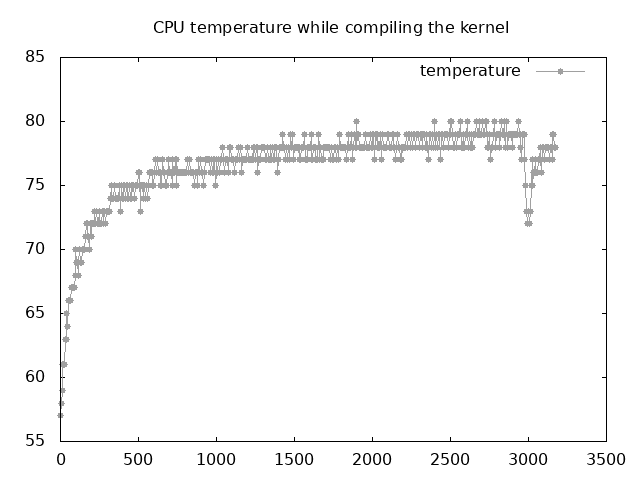
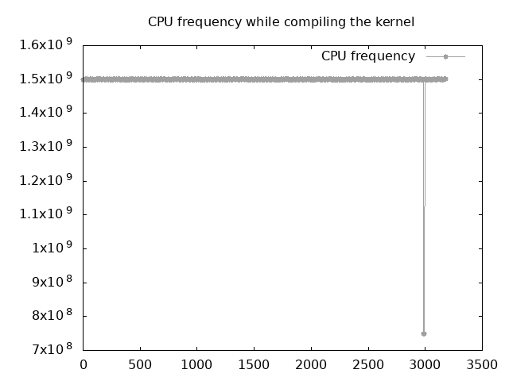

# Phan Gia Bao Le (s3688102@student.rmit.edu.au)

# Graphs

    

# Analysis

When the complication begins, the temperature of CPU also begins to raise and during the whole compiling process, the temperature is very high. It is reasonable because compilation will consume a lot of energy and computation, resulting a high temperature of CPU. When it comes to about 3000 seconds, the temperature suddenly drops, and this indicates that the compilation is finished, and the install stage begins. The install stage also needs heavy computation, so the temperature begins high again. As for the CPU's frequency, it remains in 1.5GHz, which is a very high frequency for Raspberry Pi, during the whole process except for 3000 seconds, and this phenomenon also confirms that compilation needs a lot of computation and CPU needs to work hard.

# References

1. Mckay, D. (2019, June 19). How to Use the Vmstat Command on Linux
https://www.howtogeek.com/424334/how-to-use-the-vmstat-command-on-linux/

2. StackExchange (2012, July 15). How to control the System LEDs
https://raspberrypi.stackexchange.com/questions/697/how-do-i-control-the-system-leds-using-my-software